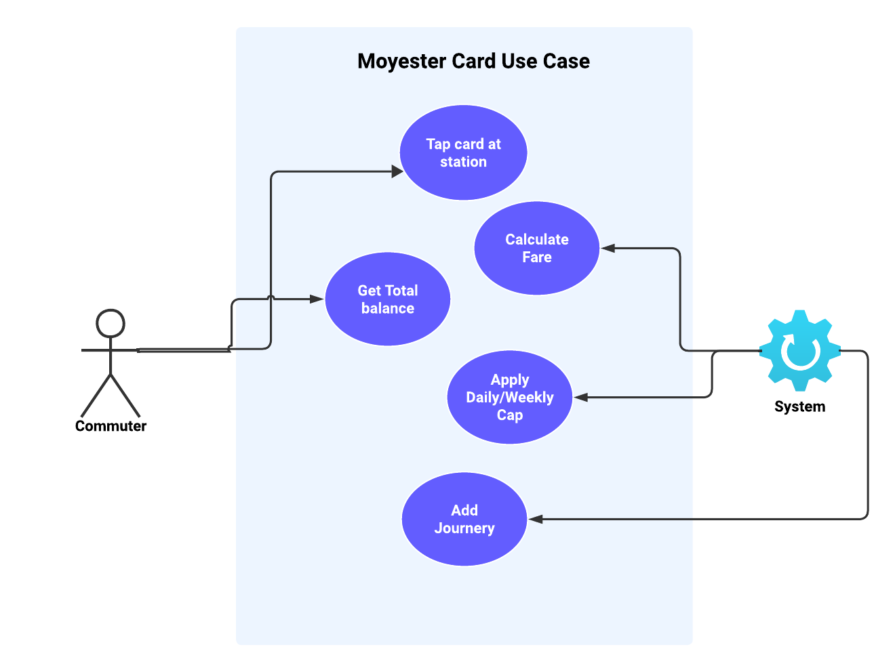
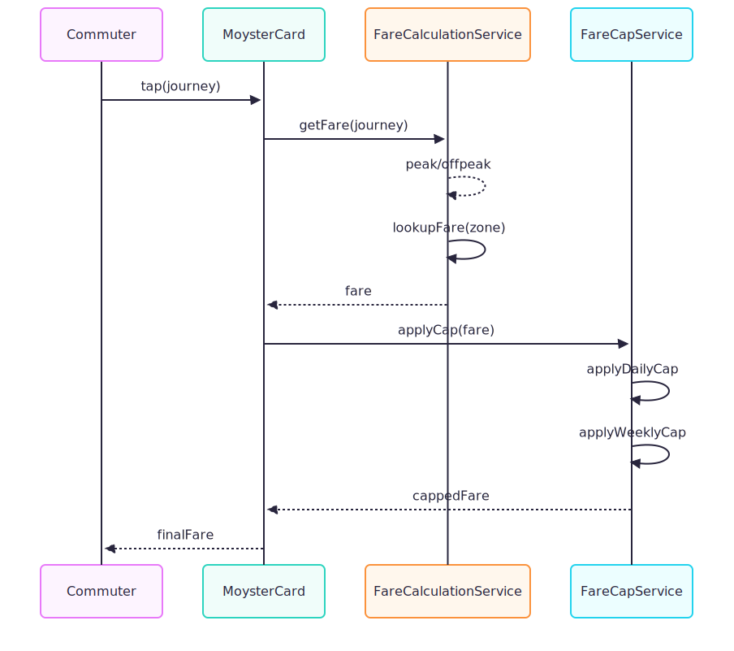

# MoysterCard Fare Calculation System

A TypeScript-based fare calculation engine for Londinium metro system.  
Commuters tap their MoysterCard at entry and exit stations, and the system calculates the fare based on **zones** and **time of travel**, applying **daily** and **weekly fare caps** automatically.

- Users have a MoysterCard with a balance.
- They can start and complete journeys between stations.
- Fares are calculated based on zones, peak/off-peak times, and daily/weekly caps.
- The system supports fare rules, peak hour rules, and capping strategies.
- The project is implemented in TypeScript and tested using Vitest.

---

## Requirements For MoysterCard
- Commuters tap their MoysterCard at entry and exit stations.
- The system muste be able to calculate the fare based on entry and exit **zone pairs (1–1, 1–2, 2–2)**.
- The system has time-based fare Rules 
    **Peak hours:**
    - Monday–Friday: 07:00–10:30, 17:00–20:00  
    - Saturday–Sunday: 09:00–11:00, 18:00–22:00  
    All other times are **off-peak**.
- The system must be able to calculate fares based on **time of travel**: **peak** and **off-peak**.
- The system must have a fare capping feature that applies **daily** and **weekly** caps.
- The fare cap must be reset after 24 hours for daily cap and after 7 days for weekly cap.
- ### Fare Capping Rules
  - The daily and weekly fare caps limit how much a commuter can be charged in a given period.
  - The applicable cap is based on the farthest zone combination traveled during that day or week.
    - Example: If all journeys are within Zone 1 except one journey to Zone 2, the Zone 1–2 cap applies.

---
## Actors
We have two main actors in our system:

- Commuter
    The commuter is the user of the metro system who holds a MoysterCard and travels between stations. The commuter interacts with the system by tapping the card at the entry and exit points, and can query total fares for their journeys.

- System
    The system is responsible for managing the fare calculation and fare capping. It records journeys, calculates fares based on zones and peak/off-peak timings, applies daily and weekly caps, and provides the commuter with their total fare.

---
## 🧱 Architecture Diagrams

### 🧩 Use Case Diagram


### 🏗️ Class Diagram


### 🏗️ Sequence Diagram



## Prerequisites
```
Node.js ≥ 18
npm
```

Install dependencies
```
npm install
```

Run tests
```
npm run test
```

Test coverage
```
npm run test:coverage
```
Current coverage: ~85–90%

Most critical logic (fare calculation, capping, card journeys) is fully covered.

Key Concepts:

### Entities

- MoysterCard: Stores balance and journeys. Supports adding journeys and deducting fare.
- Journey: Represents a single journey with entry/exit station, start/end time, and fare.
- Station: Has a name and belongs to a zone.
- Zone: Represents fare zones (1,2,…).
- FareRule: Defines fares between zone pairs for peak and off-peak times.

### Services

- FareCalculationService: Calculates fare based on a journey, zones, and peak hours.
- FareCappingServiceV2Impl: Adjusts fare using DailyCapStrategy and WeeklyCapStrategy.
- MoysterCardService: Orchestrates starting/completing journeys, calculating fare, applying capping, and deducting balance.

### Strategies

- DailyCapStrategy: Ensures daily fare does not exceed the max daily cap for the farthest zone travelled.
- WeeklyCapStrategy: Ensures weekly fare does not exceed the max weekly cap.

# Improvements & Future Enhancements 
1. Concurrency Handling
- Currently, the system runs synchronously in-memory. In a real-world backend, multiple taps (entry/exit events) could occur at the same time for the same card in a distributed system. <br>To prevent race conditions (e.g., double deductions), we can: 
    - Introduce locking mechanisms or atomic balance updates.
    - Wrap fare deduction and capping logic inside database transactions.

2. Persistent Storage
- All journeys and balances are currently stored in-memory.
- Future improvement:
    - We can integrate with a database (e.g., PostgreSQL, MongoDB, or Redis) to persist journeys and card states.

3. Enhanced Fare Cap Calculation
- Right now, fare capping logic runs per journey and checks totals in real time.
- For scalability:
    - We can move daily and weekly cap calculations to batch jobs or background workers.
    - We can add caching or precomputed totals to reduce overhead for frequent users. For example store the latest totals for each day/week in redis.